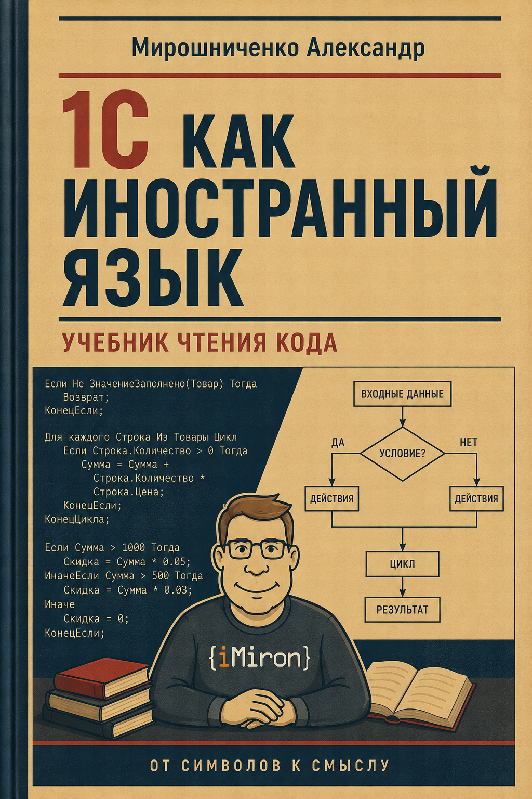

# 1С как иностранный язык

Черновик книги о программировании на платформе 1С.

## О проекте

Этот репозиторий содержит **рабочую версию книги**, которая в будущем станет полноценным учебным курсом.

Главная идея книги — рассматривать 1С не как набор синтаксических конструкций, а как **язык описания и преобразования данных в деловой системе**.

Цель — сформировать у читателя способ:
- читать код 1С как осмысленный текст
- понимать, что делает программа
- уверенно двигаться дальше в изучении платформы

Это **не готовый учебник**, а черновик в процессе написания и редакции.

---

---

## Статус

На текущий момент готовы:

- Модуль 0 — полностью
- Модуль 1 — полностью
- Модуль 2 — полностью
- Модуль 3 — начат (готов § 3.1)

Структура и содержание могут меняться.

---

## Структура репозитория

Материал разбит по модулям (главам):

```
chapters/
├── 00_vvedenie/          — Модуль 0: данные, информация, программа
├── 01_leksika/           — Модуль 1: слова языка
├── 02_semantika/         — Модуль 2: смысл слов
├── 03_struktura/         — Модуль 3: предложения и абзацы
└── ...
```

Внутри каждого модуля — параграфы в формате Markdown:

```
chapters/01_leksika/
  01-01_peremennye.md
  01-02_vyrazheniya_i_operatory.md
  ...
```

Обложка и другие медиафайлы: `assets/img/`.

---

## Принципы

Книга строится на нескольких ключевых принципах:

- 1С как язык, а не как инструмент
- объяснение через смысл, а не через синтаксис
- медленный вход для новичка
- приоритет читаемости кода
- постоянная связь с реальными задачами (сквозной пример «Канцтовары»)

---

## Для кого

- Новички без опыта программирования
- Разработчики из других языков, которые хотят «понять 1С по-настоящему»

---

## Формат

- Markdown (md)
- Линейное чтение, без гипертекста
- Минимум визуального шума
- Примеры кода максимально приближены к реальной 1С

---

## Сборка

При каждом пуше в `main` GitHub Actions автоматически собирает книгу в форматах:

| Формат | Файл       |
|--------|------------|
| EPUB   | book.epub  |
| FB2    | book.fb2   |
| PDF    | book.pdf   |
| HTML   | book.html  |
| DOCX   | book.docx  |

Готовые файлы появляются в разделе **Releases** (черновые).

---

## Статус разработки

- Параграфы пишутся целиком
- Затем проходят редактуру
- Затем правятся точечно

Файл может измениться в любой момент.

---

## Обратная связь

Замечания, ошибки и предложения приветствуются.

Особенно полезны:
- проблемы понимания
- неоднозначные формулировки
- логические разрывы
- неточности в коде

---

## Лицензия

Пока не определена.
